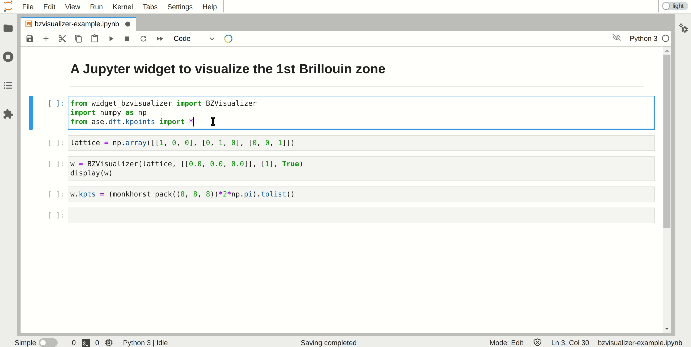

widget-bzvisualizer: Jupyter Widget to Plot the 1st Brillouin Zone
===================================================================

A Jupyter widget to plot the 1st Brillouin zone. It uses the Javascript package 
[tools-seekpath](https://github.com/materialscloud-org/tools-seekpath)
developed by Materials Cloud. You can check this widget at
[Heroku App](https://osscar-widget-bzvisualizer.herokuapp.com).

Installation
------------

To install use pip:

    $ pip install widget_bzvisualizer

For a development installation (requires [Node.js](https://nodejs.org) and [Yarn version 1](https://classic.yarnpkg.com/)),

    $ git clone https://github.com/osscar-org/widget-bzvisualizer.git
    $ cd widget-bzvisualizer
    $ pip install -e .
    $ jupyter nbextension install --py --symlink --overwrite --sys-prefix widget_bzvisualizer
    $ jupyter nbextension enable --py --sys-prefix widget_bzvisualizer

When actively developing your extension for JupyterLab, run the command:

    $ jupyter labextension develop --overwrite widget_bzvisualizer

Then you need to rebuild the JS when you make a code change:

    $ cd js
    $ yarn run build

You then need to refresh the JupyterLab page when your javascript changes.

## Acknowledgements

We acknowledge support from the EPFL Open Science Fund via the [OSSCAR](http://www.osscar.org) project.

