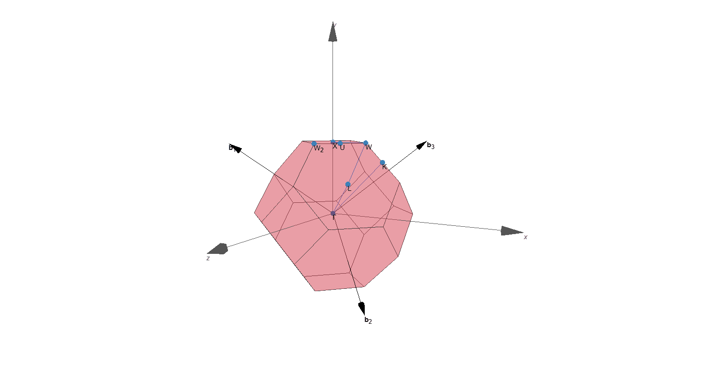

# `widget-bzvisualizer`: A Jupyter Widget as Brillouin Zone Visualizer

[](https://pypi.org/project/widget-bzvisualizer/)
[](https://github.com/osscar-org/widget-bzvisualizer/actions/workflows/widget-test.yml)
[](https://github.com/osscar-org/widget-bzvisualizer/actions/workflows/screenshot-comparison.yml)

A Jupyter widget to plot the 1st Brillouin zone of crystals. It is based on the corresponding Javascript library: https://github.com/materialscloud-org/brillouinzone-visualizer

The primary input is a crystal structure, which is parsed by [seekpath](https://github.com/giovannipizzi/seekpath) and the result is displayed by the Javascript widget using [anywidget](https://anywidget.dev/).

This repo is bootstrapped with `npm create anywidget@latest`.



## Installation & usage

```sh
pip install widget-bzvisualizer
```

For usage examples, see `example/example.ipynb`.

## Development

Install the python code:

```sh
pip install -e .[dev]
```

You then need to install the JavaScript dependencies and run the development server.

```sh
npm install
npm run dev
```

Open `example/example.ipynb` in JupyterLab, VS Code, or your favorite editor to start developing. Changes made in `js/` will be reflected in the notebook.

### Releasing and publishing a new version

In order to make a new release of the library and publish to PYPI, run

```bash
bumpver update --major/--minor/--patch
```

This will

- update version numbers, make a corresponding `git commit` and a `git tag`;
- push this commit and tag to Github, which triggers the Github Action that makes a new Github Release and publishes the package to PYPI.

### Github workflow testing

[](https://github.com/osscar-org/widget-bzvisualizer/actions/workflows/widget-test.yml)

If the `widget test` fails, it indicates there is something wrong with the code, and the widget is NOT
being displayed correctly in the test.

[](https://github.com/osscar-org/widget-bzvisualizer/actions/workflows/screenshot-comparison.yml)

If the `widget test` passes but the `screenshot comparison` fails, it indicates the appearance of the widget 
is different from the previous version. In this case, you'll need to manually download the artifact from 
the `widget test` and use it to replace the `widget-sample.png` figure in the `test` folder.

## Acknowledgements

We acknowledge support from the EPFL Open Science Fund via the [OSSCAR project](http://www.osscar.org/).


